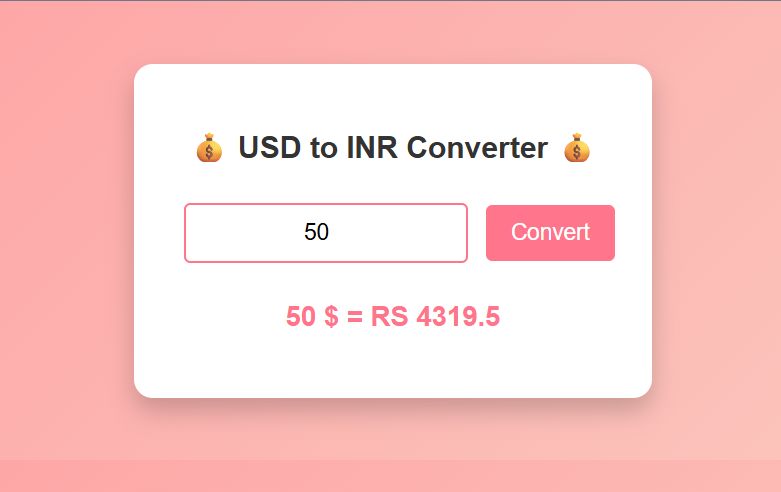

<h1 align="center">💱 USD to INR Currency Converter 💱</h1>

<p align="center">
  
  
  
  
</p>

---

## 🎯 Overview

 A **simple, smooth, and stylish** 💵 currency converter that uses real-time exchange rates via the **ExchangeRate API**. Built with **HTML, CSS, and JavaScript**, it converts **USD to INR** instantly with just a click. ⚡

---

## ✨ Features

🎉 Smooth UI with gradient background and animation  
📡 Fetches live USD ➝ INR conversion rates  
🧠 Validates input (no negatives or blanks)  
🖱️ One-click conversion with transition effects  

---

## 📸 Screenshots

| 💰 App UI Preview |
|-------------------|
|  |

---

## ⚙️ Tech Stack

| Frontend | Styling | Logic | API |
|----------|---------|-------|-----|
| `HTML5`  | `CSS3` (with animation) | `JavaScript (ES6+)` | [ExchangeRate API](https://www.exchangerate-api.com/) |

---

## 🧪 How It Works

```js
1. Enter USD amount
2. Click 'Convert'
3. Fetch exchange rate from API
4. Multiply & display result in INR 💸
